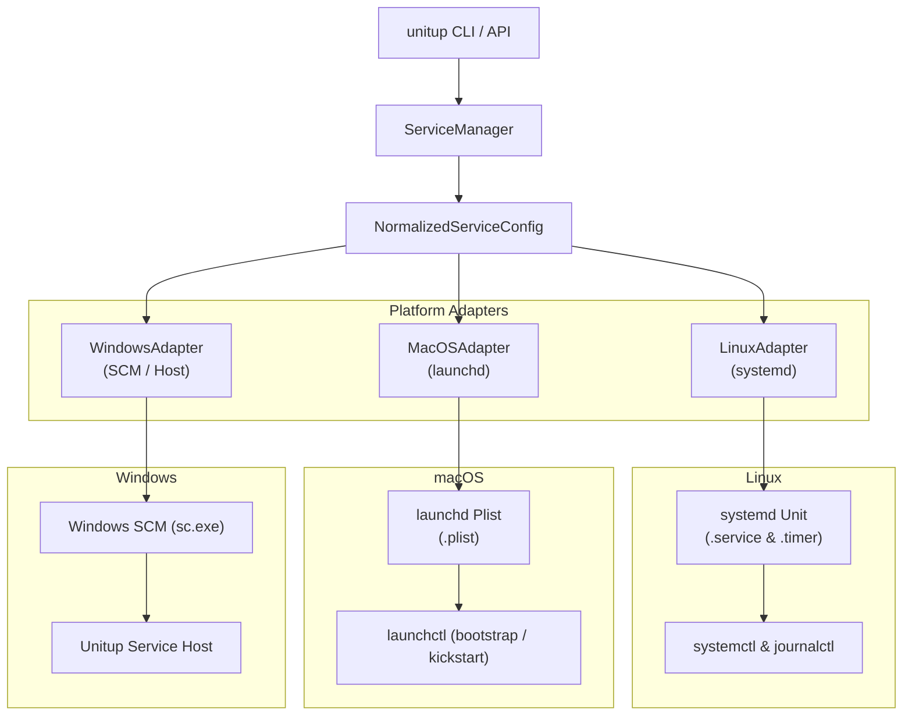

# unitup

> Minimal, zero-dependency cross-platform background service manager for Node.js, Python, Ruby, PHP, Bun, Deno, Go, Elixir, Shell scripts, and native binaries.

## What is unitup?

`unitup` is a lightweight, zero-dependency CLI tool and programmatic library designed to run and manage background applications and services natively across:
* **Linux** → `systemd` (`~/.config/systemd/user/`)
* **macOS** → `launchd` (`~/Library/LaunchAgents/` & `/Library/LaunchDaemons/`)
* **Windows** → `Windows Services` (`sc.exe` + Unitup Service Host)

Unlike traditional process managers (such as PM2) that run a persistent master daemon continuously consuming system CPU and RAM, `unitup` operates **without a resident background process**. When you run `unitup install`, `unitup start`, or `unitup status`, it interacts directly with the operating system's native service manager and exits immediately.

---

## Platform Support Table

| Feature | Linux | macOS | Windows |
| :--- | :--- | :--- | :--- |
| **Install / Uninstall** | `systemd` user/system unit | `launchd` agent/daemon plist | Windows Service (`sc.exe`) |
| **Start / Stop** | `systemctl start/stop` | `launchctl kickstart/kill` | `sc.exe start/stop` |
| **Restart** | `systemctl restart` | `launchctl kickstart -k` | SCM restart |
| **Auto-start on Boot** | `systemctl enable` | `RunAtLoad: true` | Automatic service startup |
| **Environment Variables** | `Environment=` | `EnvironmentVariables` plist dict | Environment forwarding |
| **Logs** | `journalctl` | File-based tail streaming | File-based tail streaming |
| **Crash Recovery** | `Restart=on-failure` | `KeepAlive` dictionary | Host supervisor recovery |
| **User Services** | `~/.config/systemd/user/` | `~/Library/LaunchAgents/` | Supported |
| **System Services** | `/etc/systemd/system/` | `/Library/LaunchDaemons/` | Native Windows Service |
| **Dry-Run Inspection** | `--dry-run` (systemd unit) | `--dry-run` (plist XML) | `--dry-run` (service config) |
| **Diagnostics** | `unitup doctor` | `unitup doctor` | `unitup doctor` |

---

### Architecture & Workflow



---

## Quick Start

```bash
# Install globally
npm install -g unitup

# Cross-platform installation
unitup install server.js --name api --start
unitup status api
unitup logs api --follow
unitup restart api
unitup stop api
unitup uninstall api

# Inspect what would be generated without applying changes
unitup install server.js --name api --dry-run

# Run cross-platform system diagnostics
unitup doctor

# Multi-runtime & Native Executables
unitup install worker.py --runtime python --start
unitup install ./server --runtime native --name api --start
```

---

## unitup vs PM2

`unitup` is **not** a PM2 replacement or an independent process manager. While PM2 runs its own master daemon, `unitup` is strictly a thin and transparent CLI layer on top of Linux `systemd`.

### Comparison Table

| Feature | `unitup` | PM2 |
| :--- | :--- | :--- |
| **Background Process (Daemon)** | **No resident unitup daemon**. Systemd directly supervises processes. | **Runs a persistent process-management daemon**. |
| **System Integration** | Native Linux OS `systemd` user service (`~/.config/systemd/user/`). | Custom process monitoring via PM2's internal daemon. |
| **Multi-Runtime & Executable Support** | **Node.js, Python, Ruby, PHP, Bun, Deno, Go, Elixir, Shell, and native binaries** out of the box. | **Node.js-focused process manager with support for running other commands**. |
| **Privileges Required** | Does **not** require `sudo`. | Boot integration commonly requires running the PM2 startup setup command with elevated privileges. |
| **Dependencies** | **0 Runtime Dependencies** (Uses Node.js standard modules only). | Dozens of 3rd party npm packages. |
| **Log Management** | Delegates to native Linux `journald` system (`journalctl`). | Manages `.pm2/logs` files (requires `pm2-logrotate` for rotation). |
| **Boot Startup** | Native systemd lingering (`loginctl enable-linger`). | Custom startup script launching PM2 daemon. |

---

### Core Architecture

At its core, `unitup` generates systemd service unit files directly from a generic `command + args` model rather than being hardcoded to Node.js:

```js
{
  command: "/usr/bin/python3",
  args: ["/home/user/apps/worker.py"],
  cwd: "/home/user/apps",
  env: {
    APP_ENV: "production"
  }
}
```

### Core Promises

1. ⚡ **No persistent unitup CPU or memory overhead**: After running `unitup` commands, `unitup` exits immediately. No extra master process stays running in the background.
2. 🌐 **Language-Agnostic & Executable Ready**: Works out of the box with Node.js, Python, Ruby, PHP, Bun, Deno, Go, Elixir, Shell scripts, or compiled native binaries.
3. 🔒 **Transparent systemd-native configuration**: Avoids shell execution and validates generated unit arguments (`shell: false`). Generated `.service` files are saved as standard text at `~/.config/systemd/user/`.
4. 🛠️ **Automatic Absolute Path & PATH Resolution**: Resolves absolute binary and script paths, automatically injecting proper `PATH` environment into unit files.
5. 🔄 **Backward Compatible**: Full support for existing Node.js projects, legacy CLI parameters, and old metadata formats (`{ node, script }`).

---

## Supported Runtimes

- **Node.js**: `.js`, `.mjs`, `.cjs`
- **Python**: `.py` (resolves `python3` then `python`)
- **Ruby**: `.rb` (`ruby`)
- **PHP**: `.php` (`php`)
- **Bun**: `bun`
- **Deno**: `deno` (default command: `deno run <script>`)
- **Go**: `.go` (`go run <script>`)
- **Elixir**: `.ex`, `.exs` (`elixir <script>`)
- **Shell Scripts**: `.sh` (`bash`, `sh`)
- **Native Executables**: `./server` (compiled Go, Rust, C/C++, etc.)

---

## Features

- ⚡ **Zero runtime dependencies** — lightweight, ESM-first package with CommonJS support.
- 🔒 **No sudo required for normal service creation and management** — operates entirely within systemd user scope (`~/.config/systemd/user/`).
- 🛡️ **Secure by design** — avoids shell-based command execution, validates service names, escapes systemd arguments, and sanitizes input to prevent shell injection.
- 🧠 **Systemd-Native Memory Limits** — Configure `MemoryHigh`, `MemoryMax`, and `MemorySwapMax` per service without extra monitoring daemons.
- 📜 **Journald Log Maintenance** — Advanced log streaming with filters (`--since`, `--until`, `--priority`, `--grep`, `--boot`, `--json`) and journal maintenance (`disk-usage`, `rotate`, `vacuum`).
- 🩺 **System readiness & runtime check** — `unitup doctor` verifies OS, systemd PID 1, systemctl user bus, cgroup v2 memory controller support, user lingering, and detected runtimes.
- ⏰ **Systemd Timer-Based Scheduling** — Create native `.timer` systemd units (`unitup schedule`) with interval (`--every 30m`), calendar (`--calendar daily`), boot delay (`--on-boot`), random delay jitter (`--random-delay`), and missed execution persistence (`--persistent`) without background cron daemons or continuously running worker processes.
- 📦 **Programmatic API** — imported directly into JavaScript and TypeScript applications.

---

## CLI Usage

### Project Configuration (`unitup.config.json`)

You can create a local configuration file in any project directory to define default service settings:

```bash
# Initialize a unitup.config.json file in the current folder
unitup init app.js --name my-app --memory-max 512M --env PORT=3000

# Add service using settings from unitup.config.json
unitup add

# Explicit CLI flags override settings in unitup.config.json
unitup add --memory-max 1G
```

Example `unitup.config.json`:
```json
{
  "name": "my-app",
  "group": "backend",
  "script": "app.js",
  "runtime": "node",
  "env": {
    "NODE_ENV": "production",
    "PORT": "3000"
  },
  "resources": {
    "memoryMax": "512M",
    "memoryHigh": "400M"
  },
  "restart": "on-failure"
}
```

### Memory Limits

`unitup` allows you to set native systemd memory limits for your services without running background monitoring daemons:

```bash
# Add a service with memory limits
unitup add server.js \
  --memory-high 400M \
  --memory-max 512M \
  --swap-max 256M

# Update limits on an existing service
unitup limits api --memory-high 400M --memory-max 512M

# Reset memory limits back to system defaults
unitup limits api --reset-memory
```

*Supported size units:* `128K`, `256M`, `1G`, `infinity`, `max`, or raw byte integers.

### Memory Usage Overview (`unitup memory` / `unitup top`)

```bash
# View memory usage overview for all running services & schedules
unitup top

# Alias: unitup memory or unitup mem
unitup memory

# Filter memory overview by group
unitup top --group backend

# View detailed memory breakdown for a specific app
unitup memory api
```

Example Output:
```text
NAME       GROUP      TYPE       STATUS     PID      MEMORY     PEAK       LIMIT (MAX)
api        backend    service    running    14220    284 MB     361 MB     512 MB
worker     backend    service    running    14302    120 MB     150 MB     1 GB
cleanup    backend    timer      waiting    -        0 MB       unavailable 1 GB

Total Memory Usage across 2 active app(s): 404 MB
```

### Journald Log Maintenance

```bash
# Filter logs by time, priority, grep keyword, boot, or JSON output
unitup logs api --since 1h --until now
unitup logs api --priority err --grep "timeout"
unitup logs api --boot --json

# Journal storage maintenance
unitup journal disk-usage
unitup journal rotate
unitup journal vacuum --size 500M
unitup journal vacuum --time 14d
unitup journal vacuum --files 10 --yes
```

> [!NOTE]
> `unitup journal vacuum` prompts for user confirmation before executing system-wide log cleanup unless `--yes` / `-y` or `--dry-run` is provided. If permissions are insufficient, `unitup` handles it gracefully without executing `sudo`.

### Systemd Timer Schedules (`unitup schedule`)

`unitup` allows you to schedule tasks completely via native systemd `.timer` units without running background daemons, cron services, or continuous worker loops.

Each schedule creates a paired service (`~/.config/systemd/user/unitup-<name>.service`) with `Type=oneshot` and timer (`~/.config/systemd/user/unitup-<name>.timer`).

```bash
# Interval schedule (--every)
unitup schedule cleanup.js --every 30m --persistent --start

# Calendar schedule (--calendar)
unitup schedule backup.py --calendar daily --random-delay 10m --persistent --start

# Complex calendar expression
unitup schedule report.js --calendar "Mon..Fri 09:00" --start

# List all active schedule timers
unitup schedules   # or unitup timers

# Detailed schedule status
unitup schedule-status cleanup   # or unitup timer-status cleanup

# Manually run the schedule service once (leaves timer schedule unchanged)
unitup schedule-run cleanup

# Enable or disable schedule timers
unitup schedule-enable cleanup
unitup schedule-disable cleanup

# Remove schedule timer, service unit, and metadata
unitup schedule-remove cleanup [--force]

# Read scheduled task logs
unitup schedule-logs cleanup
```

#### Schedule Options

- `--every <duration>`: Execution interval (e.g., `30s`, `10m`, `2h`, `1d`). Generates `OnActiveSec` and `OnUnitActiveSec`.
- `--calendar <expression>`: Systemd calendar expression (e.g., `daily`, `weekly`, `"Mon..Fri 09:00"`). Validated via `systemd-analyze calendar`.
- `--on-boot <duration>`: Delay execution relative to system boot (e.g., `5m`).
- `--on-active <duration>`: Delay execution relative to timer activation.
- `--random-delay <duration>`: Adds a randomized delay jitter to prevent simultaneous job stampedes (e.g., `10m`).
- `--persistent`: Sets `Persistent=true` so systemd executes missed schedules immediately after system boot or wake.
- `--start`: Automatically enables and starts the timer unit after creation (`systemctl --user enable --now`).

---

## Requirements

- **OS:** Linux with `systemd`
- **Node.js:** `>= 20.0.0`
- **Permissions:** Standard non-root user session

---

## Installation

```bash
npm install -g unitup
```

Or install locally in your project:

```bash
npm install unitup
```

---

## CLI Usage

### Multi-Runtime Examples

```bash
# Node.js
unitup add server.js --runtime node

# Python
unitup add worker.py --runtime python

# Ruby
unitup add app.rb --runtime ruby

# PHP (with runtime flags)
unitup add index.php --runtime php --runtime-arg -S --runtime-arg 0.0.0.0:8080

# Bun
unitup add server.ts --runtime bun

# Deno (with runtime permission flags)
unitup add server.ts --runtime deno --runtime-arg --allow-net --runtime-arg --allow-env

# Go
unitup add main.go --runtime go

# Elixir
unitup add app.exs --runtime elixir

# Native Executable
unitup add ./server --runtime native --name api

# Generic Command Line Usage (bypasses runtime detection)
unitup add \
  --name worker \
  --command /usr/bin/python3 \
  --arg /home/user/apps/worker.py \
  --arg --port \
  --arg 3000
```

> *Note: For production deployments, compiling the Go application and registering the resulting native binary is recommended.*

---

## Automatic Runtime & Shebang Detection

`unitup` automatically detects the runtime based on file extension and shebang headers:

```text
.js, .mjs, .cjs → node
.py             → python
.rb             → ruby
.php            → php
.sh             → shell
.go             → go
.ex, .exs       → elixir
```

Shebang examples detected automatically:

```text
#!/usr/bin/env python3
#!/usr/bin/env node
#!/usr/bin/env ruby
#!/bin/bash
```

For ambiguous extensions such as `.ts`, `unitup` requires explicit runtime selection:

```text
Could not determine runtime for server.ts.

Specify one:
  unitup add server.ts --runtime bun
  unitup add server.ts --runtime deno
  unitup add server.ts --runtime node
```

---

## Native Executable Support

When adding a native executable:

```bash
unitup add ./server --runtime native --name api
```

`unitup` checks that the file:
1. Exists
2. Is a regular file
3. Has execute permission (`chmod +x`)

If execute permission is missing, `unitup` does **not** modify permissions automatically; it provides a helpful command suggestion:

```text
The executable is not runnable.

Run:
  chmod +x /home/user/apps/server
```

---

## CLI Commands Reference

### `unitup doctor`

Performs comprehensive system readiness and runtime diagnostic checks:

```text
unitup doctor

✓ Linux detected
✓ systemctl available
✓ systemd is running
✓ systemd user services available

Detected runtimes:
✓ Node.js: /usr/bin/node
✓ Python: /usr/bin/python3
✓ Ruby: /usr/bin/ruby
✓ Go: /usr/local/go/bin/go
- Bun: not found
- Deno: not found
- Elixir: not found

✓ Unit directory writable
! User lingering is disabled

Enable it manually:
  loginctl enable-linger username
```

*Note: Missing optional runtimes do not cause `unitup doctor` to exit with an error.*

---

### Missing Runtime Handling

If a requested runtime is not installed on the system, `unitup` provides clear installation guidance:

```text
Python runtime could not be found.

Install Python or specify its path:
  unitup add worker.py --command /usr/bin/python3
```

---

### `unitup add`

Creates a new systemd user service unit file at `~/.config/systemd/user/unitup-<name>.service`.

```bash
unitup add worker.py --name worker --group backend --start
```

**Options:**
- `--name <name>`: Custom service name (defaults to script file name without extension).
- `--runtime <name>`: Specify runtime (`node`, `python`, `ruby`, `php`, `bun`, `deno`, `shell`, `go`, `elixir`, `native`).
- `--runtime-arg <val>`: Pass flag/argument to runtime binary (can be specified multiple times).
- `--command <path>`: Explicit binary executable path (bypasses auto-detection).
- `--arg <value>`: Script/command argument (can be specified multiple times).
- `--group <group>`: Assign service to a group (default: `default`).
- `--cwd <path>`: Working directory (defaults to script directory).
- `--env KEY=value`: Pass environment variable (can be specified multiple times).
- `--env-file <file>`: Path to environment file (adds `EnvironmentFile=...`).
- `--restart <policy>`: Systemd restart policy (`on-failure`, `always`, `no`, `on-abnormal`. Default: `on-failure`).
- `--start`: Automatically enables and starts the service immediately (`systemctl --user enable --now`).
- `--force`, `-f`: Force overwrite of an existing service if it is currently running.

Generated unit file example (`~/.config/systemd/user/unitup-worker.service`):

```ini
[Unit]
Description=unitup service: worker
After=network.target

[Service]
Type=simple
SyslogIdentifier=unitup-worker
WorkingDirectory=/home/user/apps
ExecStart=/usr/bin/python3 /home/user/apps/worker.py
Restart=on-failure
RestartSec=3
Environment=PATH="/usr/bin:/usr/local/bin:/bin"
Environment=APP_ENV="production"

[Install]
WantedBy=default.target
```

---

### `unitup list` / `unitup ls`

Lists all user services managed by `unitup`:

```bash
unitup list
```

```text
NAME      RUNTIME    STATUS     PID      COMMAND
api       node       running    14220    node server.js
worker    python     running    14302    python3 worker.py
server    native     stopped    -        ./server
```

Filter by group:

```bash
unitup list --group backend
```

---

### `unitup inspect <name>`

View detailed configuration and status overview for a service (without revealing secrets or environment variables):

```bash
unitup inspect worker
```

```text
Name: worker
Runtime: python
Group: backend
Status: running
Command: /usr/bin/python3
Arguments: /home/user/apps/worker.py
Working directory: /home/user/apps
Unit: unitup-worker.service
```

---

### `unitup start <name|@group>`

Starts a service or an entire group:

```bash
unitup start worker
unitup start @backend --enable
```

---

### `unitup stop <name|@group>`

Stops a service or an entire group:

```bash
unitup stop @backend
```

---

### `unitup restart <name|@group>`

Restarts a service or an entire group:

```bash
unitup restart worker
unitup restart @backend
```

---

### `unitup status <name>`

Shows compact status summary for the service:

```text
worker

Status: running
PID: 14302
Started: 15 minutes ago
Restarts: 0
Command: /usr/bin/python3
Arguments: /home/user/apps/worker.py
Working directory: /home/user/apps
```

Pass `--raw` for raw `systemctl status` output:

```bash
unitup status worker --raw
```

---

### `unitup logs <name>`

View or stream systemd journalctl logs for a service:

```bash
# Stream logs in real-time
unitup logs worker --follow

# Clean raw console output without systemd timestamp/hostname metadata prefix
unitup logs worker -c --lines 50
```

---

### `unitup failures`

Lists all currently failed services with exit codes and restart counts:

```bash
unitup failures
```

---

### `unitup remove <name|@group>`

Stops, disables, and deletes the unit file, then reloads systemd. If the service is currently running, `unitup` prevents accidental deletion and requires `--force` / `-f`:

```bash
# Remove stopped service
unitup remove worker

# Force remove an actively running service or group
unitup remove worker --force
unitup remove @backend -f
```

---

## User Lingering & Persistence Across Logout

Depending on the Linux distribution and systemd-logind configuration, user services may stop after logout. Enable lingering to allow them to continue running without an active login session:

```bash
loginctl enable-linger $USER
```

---

## Programmatic JavaScript & TypeScript API

`unitup` includes full TypeScript declaration files (`index.d.ts`). You can import `unitup` directly into JavaScript or TypeScript applications:

### Generic `command + args` Example (Language-Agnostic)

```ts
import { createService } from "unitup";

await createService({
  name: "worker",
  command: "/usr/bin/python3",
  args: ["/home/user/apps/worker.py"],
  cwd: "/home/user/apps",
  restart: "on-failure",
  start: true
});
```

### CommonJS Support

```js
const {
  createService,
  createSchedule,
  listSchedules
} = require("unitup");

await createSchedule({
  name: "cleanup",
  script: "./cleanup.js",
  every: "30m",
  start: true
});
```

### Programmatic Schedule API Example

```ts
import {
  createSchedule,
  listSchedules,
  getScheduleStatus,
  runSchedule,
  enableSchedule,
  disableSchedule,
  removeSchedule
} from "unitup";

// Create an interval schedule
await createSchedule({
  name: "cleanup",
  script: "./cleanup.js",
  runtime: "node",
  every: "30m",
  persistent: true,
  start: true
});

// Create a calendar schedule with random delay jitter
await createSchedule({
  name: "backup",
  script: "./backup.py",
  runtime: "python",
  calendar: "daily",
  randomDelay: "10m",
  persistent: true,
  start: true
});

// List all active schedules
const schedules = await listSchedules();
console.log(schedules);

// Manually trigger a schedule run
await runSchedule("cleanup");

// Disable and remove schedule
await disableSchedule("cleanup");
await removeSchedule("cleanup");
```

### Script & Runtime Example

```ts
import {
  createService,
  startService,
  stopService,
  restartService,
  removeService,
  getServiceStatus,
  listServices,
  inspectService,
  detectRuntime,
  resolveRuntimeConfig,
  isSystemdAvailable
} from "unitup";

import type {
  CreateServiceOptions,
  ServiceStatus
} from "unitup";

if (await isSystemdAvailable()) {
  // Add a Python worker service via script path
  await createService({
    name: "worker",
    script: "./worker.py",
    runtime: "python",
    env: {
      APP_ENV: "production"
    },
    start: true
  });

  // Inspect service configuration
  const info = await inspectService("worker");
  console.log(`Command: ${info.command}, Status: ${info.status}`);

  // List all unitup services
  const services = await listServices();
  console.log(services);
}
```

---

## Declarative Project Configuration (Roadmap Preview)

Define your application stack declaratively using `unitup.yml` or `unitup.json` and sync it with systemd user services:

```yaml
# unitup.yml
apps:
  api:
    runtime: node
    script: ./server.js
    env:
      NODE_ENV: production
      PORT: 3000
    start: true

  worker:
    runtime: python
    script: ./worker.py
    env:
      APP_ENV: production

  native-service:
    runtime: native
    command: ./server
```

> *Note: Relative script, command, cwd, and env-file paths are resolved relative to the configuration file.*

### Planned Declarative Commands:

```bash
# Preview differences between unitup.yml and active systemd units
unitup diff

# Apply unitup.yml configuration and create/update systemd user services
unitup apply

# Perform batch operations on group
unitup restart @default
```

---

## License

[MIT](LICENSE)
